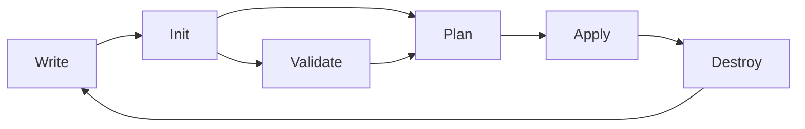

# Essential Terraform Commands

## 🎯 Learning Objectives

By the end of this tutorial, you will:
- Understand the Terraform workflow and command lifecycle
- Know how to use essential Terraform commands
- Be able to troubleshoot common command issues
- Understand when to use each command in your workflow

## 📋 Prerequisites

- Terraform installed (from previous tutorial)
- VS Code with Terraform extension (recommended)
- Basic understanding of command line usage

## 🔄 The Terraform Workflow

Terraform follows a consistent workflow pattern:



## 🛠️ Essential Commands

### 1. `terraform version` - Check Your Installation

**Purpose**: Verify Terraform installation and version information

```bash
# Check Terraform version
terraform version

# Check version in JSON format
terraform version -json
```

**Expected Output**:
```
Terraform v1.6.0
on darwin_amd64

Your version of Terraform is out of date! The latest version
is 1.6.1. You can update by downloading from https://www.terraform.io/downloads.html
```

**When to use**: 
- ✅ Verify installation
- ✅ Check for updates
- ✅ Troubleshoot compatibility issues

### 2. `terraform init` - Initialize Your Project

**Purpose**: Initialize a Terraform working directory

```bash
# Basic initialization
terraform init

# Initialize with backend configuration
terraform init -backend-config="key=prod.tfstate"

# Upgrade providers to latest versions
terraform init -upgrade

# Initialize without backend
terraform init -backend=false
```

**What it does**:
- Downloads provider plugins
- Sets up backend configuration
- Initializes modules
- Creates `.terraform` directory

**When to use**:
- ✅ First time in a new project
- ✅ After adding new providers
- ✅ When changing backend configuration
- ✅ After cloning a repository

**Common Options**:
- `-upgrade`: Update plugins to latest versions
- `-reconfigure`: Reconfigure backend settings
- `-migrate-state`: Migrate state during backend changes

### 3. `terraform validate` - Check Configuration Syntax

**Purpose**: Validate configuration files for syntax and internal consistency

```bash
# Basic validation
terraform validate

# Validate with JSON output
terraform validate -json

# No color output (useful for CI/CD)
terraform validate -no-color
```

**What it checks**:
- ✅ Configuration syntax
- ✅ Argument names and types
- ✅ Required arguments presence
- ✅ Reference validity

**What it doesn't check**:
- ❌ Provider-specific validation
- ❌ Resource dependencies
- ❌ Access permissions

**When to use**:
- ✅ Before planning changes
- ✅ In CI/CD pipelines
- ✅ During development
- ✅ Code review process

### 4. `terraform plan` - Preview Changes

**Purpose**: Create an execution plan showing what Terraform will do

```bash
# Basic plan
terraform plan

# Save plan to file
terraform plan -out=tfplan

# Plan for specific target
terraform plan -target=azurerm_resource_group.main

# Plan with variable file
terraform plan -var-file="production.tfvars"

# Plan with inline variables
terraform plan -var="location=East US"

# Destroy plan
terraform plan -destroy
```

**Plan Output Symbols**:
- `+` = Resource will be created
- `-` = Resource will be destroyed  
- `~` = Resource will be modified in-place
- `-/+` = Resource will be destroyed and recreated

**When to use**:
- ✅ Before applying changes
- ✅ Code review process
- ✅ Understanding impact
- ✅ Troubleshooting issues

**Example Output**:
```
Terraform will perform the following actions:

  # azurerm_resource_group.main will be created
  + resource "azurerm_resource_group" "main" {
      + id       = (known after apply)
      + location = "East US"
      + name     = "my-resource-group"
    }

Plan: 1 to add, 0 to change, 0 to destroy.
```

### 5. `terraform apply` - Deploy Infrastructure

**Purpose**: Apply the changes required to reach the desired state

```bash
# Apply with confirmation prompt
terraform apply

# Apply without confirmation (use with caution!)
terraform apply -auto-approve

# Apply a saved plan
terraform apply "tfplan"

# Apply specific target only
terraform apply -target=azurerm_resource_group.main

# Apply with variables
terraform apply -var="location=West US"
```

**Interactive Process**:
1. Shows execution plan
2. Asks for confirmation (unless `-auto-approve`)
3. Applies changes
4. Updates state file

**When to use**:
- ✅ Deploy new infrastructure
- ✅ Update existing resources
- ✅ After successful plan review

**Safety Tips**:
- Always review the plan first
- Use `-auto-approve` only in automation
- Start with non-production environments

### 6. `terraform destroy` - Remove Infrastructure

**Purpose**: Destroy all resources managed by Terraform

```bash
# Destroy with confirmation
terraform destroy

# Destroy without confirmation
terraform destroy -auto-approve

# Destroy specific target
terraform destroy -target=azurerm_resource_group.main

# Destroy with variables
terraform destroy -var-file="production.tfvars"
```

**What it does**:
- Removes all managed resources
- Updates state file
- Does not delete state file itself

**When to use**:
- ✅ Clean up development environments
- ✅ Remove test infrastructure  
- ✅ Decommission projects

**Safety Considerations**:
- ⚠️ **IRREVERSIBLE OPERATION**
- ⚠️ Always backup important data first
- ⚠️ Double-check environment before destroying

### 7. `terraform fmt` - Format Code

**Purpose**: Format Terraform configuration files to standard style

```bash
# Format current directory
terraform fmt

# Format recursively
terraform fmt -recursive

# Check if formatting is needed (returns exit code)
terraform fmt -check

# Show differences
terraform fmt -diff

# Write to stdout instead of overwriting
terraform fmt -write=false
```

**What it fixes**:
- ✅ Indentation consistency
- ✅ Spacing around operators
- ✅ Argument alignment
- ✅ Block formatting

**When to use**:
- ✅ Before committing code
- ✅ In pre-commit hooks
- ✅ During code review
- ✅ IDE save actions

## 🔍 Advanced Commands

### State Management

```bash
# List resources in state
terraform state list

# Show specific resource
terraform state show azurerm_resource_group.main

# Move resource in state
terraform state mv azurerm_resource_group.old azurerm_resource_group.new

# Remove resource from state
terraform state rm azurerm_resource_group.unwanted
```

### Output Management

```bash
# Show all outputs
terraform output

# Show specific output
terraform output resource_group_name

# Output in JSON format
terraform output -json
```

### Configuration Management

```bash
# Show current configuration
terraform show

# Show in JSON format
terraform show -json

# Refresh state without applying changes
terraform refresh
```

## 🧪 Hands-On Exercise

Let's practice with a simple example:

### 1. Create a Basic Configuration

Create `main.tf`:
```hcl
terraform {
  required_providers {
    azurerm = {
      source  = "hashicorp/azurerm"
      version = "~> 3.0"
    }
  }
}

provider "azurerm" {
  features {}
}

resource "azurerm_resource_group" "example" {
  name     = "rg-terraform-commands-demo"
  location = "East US"
  
  tags = {
    Environment = "Learning"
    Purpose     = "Terraform Commands Demo"
  }
}
```

### 2. Follow the Workflow

```bash
# 1. Initialize the project
terraform init

# 2. Validate the configuration
terraform validate

# 3. Format the code
terraform fmt

# 4. Plan the deployment
terraform plan

# 5. Apply the changes
terraform apply

# 6. Check the outputs
terraform output

# 7. Clean up
terraform destroy
```

## ❓ Troubleshooting Common Issues

### "terraform: command not found"
```bash
# Check if Terraform is in PATH
echo $PATH
which terraform

# Restart terminal or reload shell
source ~/.bashrc  # or ~/.zshrc
```

### "No configuration files found"
```bash
# Ensure you're in the correct directory
ls *.tf

# Check for .tf files in current directory
find . -name "*.tf"
```

### "Backend initialization required"
```bash
# Run init to configure backend
terraform init

# If backend changed, reconfigure
terraform init -reconfigure
```

### "Resource already exists"
```bash
# Import existing resource
terraform import azurerm_resource_group.example /subscriptions/sub-id/resourceGroups/existing-rg

# Or remove from state if not needed
terraform state rm azurerm_resource_group.example
```

## ✅ Command Reference Quick Guide

| Command | Purpose | When to Use |
|---------|---------|-------------|
| `terraform version` | Check installation | Setup verification |
| `terraform init` | Initialize project | First run, new providers |
| `terraform validate` | Check syntax | Before planning |
| `terraform fmt` | Format code | Before committing |
| `terraform plan` | Preview changes | Before applying |
| `terraform apply` | Deploy changes | After plan review |
| `terraform destroy` | Remove resources | Cleanup |

## 🚀 Next Steps

Now that you understand Terraform commands:
1. ✅ **Complete**: Essential Terraform commands
2. 🔄 **Next**: [Understanding Resources](../3-terraform-resources/)
3. 🎯 **Goal**: Learn how to define and manage resources

## 💡 Pro Tips

- **Always run `terraform plan` before `terraform apply`**
- **Use `terraform fmt` before committing code**
- **Save important plans**: `terraform plan -out=plan.tfplan`
- **Use tab completion**: Many shells support Terraform tab completion
- **Check exit codes**: Terraform commands return meaningful exit codes for scripting

## 📚 Additional Resources

- [Terraform CLI Documentation](https://www.terraform.io/docs/cli/index.html)
- [Terraform Commands Reference](https://www.terraform.io/docs/cli/commands/index.html)
- [Terraform Workflow Guide](https://learn.hashicorp.com/tutorials/terraform/associate-study-guide)