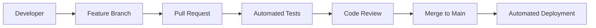

# Modern Terraform Tooling and Workflows

## 📋 Overview

Learn about contemporary Terraform development practices, tooling, and workflows that enhance productivity, collaboration, and infrastructure reliability. This section covers the modern Terraform ecosystem and professional development practices.

## 🎯 Learning Objectives

By the end of this section, you will be able to:
- Set up a professional Terraform development environment
- Use modern IDE integrations and productivity tools
- Implement automated formatting and validation workflows
- Collaborate effectively with teams using Terraform
- Leverage cloud-native Terraform platforms and services

## 📚 Prerequisites

- Completed previous sections (basic understanding of Terraform)
- Familiarity with version control (Git)
- Basic understanding of CI/CD concepts

## 🛠️ Modern Development Environment

### 1. IDE Setup and Extensions

#### Visual Studio Code Extensions

Essential extensions for Terraform development:

```json
{
  "recommendations": [
    "hashicorp.terraform",
    "ms-vscode.vscode-json",
    "ms-azure-devops.azure-pipelines",
    "ms-vscode.azure-account",
    "redhat.vscode-yaml",
    "ms-python.python",
    "golang.go",
    "github.copilot",
    "github.vscode-pull-request-github"
  ]
}
```

#### VS Code Settings for Terraform

Create `.vscode/settings.json`:

```json
{
  "terraform.experimentalFeatures": {
    "validateOnSave": true,
    "prefillRequiredFields": true
  },
  "terraform.languageServer": {
    "external": true,
    "pathToBinary": "",
    "args": ["serve"]
  },
  "files.associations": {
    "*.tf": "terraform",
    "*.tfvars": "terraform"
  },
  "editor.formatOnSave": true,
  "editor.codeActionsOnSave": {
    "source.fixAll": true
  },
  "[terraform]": {
    "editor.defaultFormatter": "hashicorp.terraform",
    "editor.formatOnSave": true,
    "editor.tabSize": 2
  }
}
```

### 2. Development Tools

#### Terraform Language Server

Install and configure the Terraform Language Server:

```bash
# Install via Go
go install github.com/hashicorp/terraform-ls@latest

# Or download binary from releases
curl -LO https://releases.hashicorp.com/terraform-ls/0.31.5/terraform-ls_0.31.5_linux_amd64.zip
```

#### Pre-commit Hooks

Set up automated validation with pre-commit:

```yaml
# .pre-commit-config.yaml
repos:
  - repo: https://github.com/antonbabenko/pre-commit-terraform
    rev: v1.83.2
    hooks:
      - id: terraform_fmt
      - id: terraform_validate
      - id: terraform_docs
        args:
          - --hook-config=--path-to-file=README.md
          - --hook-config=--add-to-existing-file=true
          - --hook-config=--create-file-if-not-exist=true
      - id: terraform_tflint
        args:
          - --args=--only=terraform_deprecated_interpolation
          - --args=--only=terraform_deprecated_index
          - --args=--only=terraform_unused_declarations
          - --args=--only=terraform_comment_syntax
          - --args=--only=terraform_documented_outputs
          - --args=--only=terraform_documented_variables
          - --args=--only=terraform_typed_variables
          - --args=--only=terraform_module_pinned_source
          - --args=--only=terraform_naming_convention
          - --args=--only=terraform_required_version
      - id: terraform_tfsec
      - id: terraform_checkov
  - repo: https://github.com/pre-commit/pre-commit-hooks
    rev: v4.4.0
    hooks:
      - id: trailing-whitespace
      - id: end-of-file-fixer
      - id: check-yaml
      - id: check-added-large-files
```

#### Installation and Usage

```bash
# Install pre-commit
pip install pre-commit

# Install hooks
pre-commit install

# Run manually
pre-commit run --all-files
```

### 3. Modern Terraform Toolchain

#### Terraform Version Management

Use `tfenv` for managing multiple Terraform versions:

```bash
# Install tfenv (macOS)
brew install tfenv

# Install specific Terraform version
tfenv install 1.6.0
tfenv use 1.6.0

# List available versions
tfenv list-remote
tfenv list
```

#### Enhanced CLI Tools

**Terragrunt** for DRY configurations:

```bash
# Install Terragrunt
brew install terragrunt

# Basic terragrunt.hcl
include "root" {
  path = find_in_parent_folders()
}

terraform {
  source = "git::https://github.com/terraform-aws-modules/terraform-aws-vpc.git?ref=v3.0.0"
}

inputs = {
  name = "my-vpc"
  cidr = "10.0.0.0/16"
}
```

**Terraform Docs** for automatic documentation:

```bash
# Install terraform-docs
brew install terraform-docs

# Generate documentation
terraform-docs markdown table . > README.md

# Configuration file
cat > .terraform-docs.yml << EOF
formatter: "markdown table"
output:
  file: "README.md"
  mode: inject
settings:
  anchor: true
  color: true
EOF
```

## 🚀 Modern Workflow Patterns

### 1. GitOps Workflow



#### GitHub Actions Workflow

```yaml
# .github/workflows/terraform.yml
name: Terraform CI/CD

on:
  push:
    branches: [ main ]
  pull_request:
    branches: [ main ]

jobs:
  terraform:
    runs-on: ubuntu-latest
    
    steps:
    - uses: actions/checkout@v3
    
    - name: Setup Terraform
      uses: hashicorp/setup-terraform@v2
      with:
        terraform_version: 1.6.0
        
    - name: Terraform Format Check
      run: terraform fmt -check
      
    - name: Terraform Init
      run: terraform init
      env:
        ARM_CLIENT_ID: ${{ secrets.ARM_CLIENT_ID }}
        ARM_CLIENT_SECRET: ${{ secrets.ARM_CLIENT_SECRET }}
        ARM_SUBSCRIPTION_ID: ${{ secrets.ARM_SUBSCRIPTION_ID }}
        ARM_TENANT_ID: ${{ secrets.ARM_TENANT_ID }}
        
    - name: Terraform Validate
      run: terraform validate
      
    - name: Terraform Plan
      run: terraform plan -no-color
      env:
        ARM_CLIENT_ID: ${{ secrets.ARM_CLIENT_ID }}
        ARM_CLIENT_SECRET: ${{ secrets.ARM_CLIENT_SECRET }}
        ARM_SUBSCRIPTION_ID: ${{ secrets.ARM_SUBSCRIPTION_ID }}
        ARM_TENANT_ID: ${{ secrets.ARM_TENANT_ID }}
        
    - name: Terraform Apply
      if: github.ref == 'refs/heads/main' && github.event_name == 'push'
      run: terraform apply -auto-approve
      env:
        ARM_CLIENT_ID: ${{ secrets.ARM_CLIENT_ID }}
        ARM_CLIENT_SECRET: ${{ secrets.ARM_CLIENT_SECRET }}
        ARM_SUBSCRIPTION_ID: ${{ secrets.ARM_SUBSCRIPTION_ID }}
        ARM_TENANT_ID: ${{ secrets.ARM_TENANT_ID }}
```

### 2. Environment Management

#### Directory Structure

```
terraform/
├── environments/
│   ├── development/
│   │   ├── main.tf
│   │   ├── variables.tf
│   │   └── terraform.tfvars
│   ├── staging/
│   │   ├── main.tf
│   │   ├── variables.tf
│   │   └── terraform.tfvars
│   └── production/
│       ├── main.tf
│       ├── variables.tf
│       └── terraform.tfvars
├── modules/
│   ├── networking/
│   ├── compute/
│   └── database/
└── shared/
    ├── variables.tf
    └── outputs.tf
```

#### Workspace Management

```bash
# Create workspaces for environments
terraform workspace new development
terraform workspace new staging
terraform workspace new production

# Switch between workspaces
terraform workspace select development

# List workspaces
terraform workspace list

# Environment-specific configuration
locals {
  environment = terraform.workspace
  
  config = {
    development = {
      vm_size = "Standard_B1s"
      instance_count = 1
    }
    staging = {
      vm_size = "Standard_B2s"
      instance_count = 2
    }
    production = {
      vm_size = "Standard_D2s_v3"
      instance_count = 5
    }
  }
  
  current_config = local.config[local.environment]
}
```

### 3. Cloud-Native Platforms

#### Terraform Cloud

Set up Terraform Cloud integration:

```hcl
terraform {
  cloud {
    organization = "your-org"
    
    workspaces {
      name = "azure-infrastructure"
    }
  }
}
```

#### Azure DevOps Integration

```yaml
# azure-pipelines.yml
trigger:
- main

pool:
  vmImage: 'ubuntu-latest'

variables:
  terraformVersion: '1.6.0'

stages:
- stage: Validate
  jobs:
  - job: validate
    steps:
    - task: TerraformInstaller@0
      inputs:
        terraformVersion: $(terraformVersion)
    
    - task: TerraformTaskV4@4
      inputs:
        provider: 'azurerm'
        command: 'init'
        backendServiceArm: 'Azure Service Connection'
        backendAzureRmResourceGroupName: 'terraform-state-rg'
        backendAzureRmStorageAccountName: 'terraformstate'
        backendAzureRmContainerName: 'tfstate'
        backendAzureRmKey: 'terraform.tfstate'
    
    - task: TerraformTaskV4@4
      inputs:
        provider: 'azurerm'
        command: 'validate'

- stage: Plan
  dependsOn: Validate
  jobs:
  - job: plan
    steps:
    - task: TerraformTaskV4@4
      inputs:
        provider: 'azurerm'
        command: 'plan'
        environmentServiceNameAzureRM: 'Azure Service Connection'
```

## 🔧 Development Best Practices

### 1. Code Organization

#### Module Structure

```
modules/azure-vm/
├── main.tf              # Primary resource definitions
├── variables.tf         # Input variables
├── outputs.tf           # Output values
├── versions.tf          # Provider requirements
├── README.md           # Module documentation
├── examples/           # Usage examples
│   └── complete/
│       ├── main.tf
│       └── variables.tf
└── tests/             # Module tests
    └── basic_test.go
```

#### Naming Conventions

```hcl
# Resource naming
resource "azurerm_resource_group" "main" {
  name     = "${var.project}-${var.environment}-rg"
  location = var.location
  
  tags = local.common_tags
}

# Variable naming
variable "project_name" {
  description = "Name of the project"
  type        = string
  validation {
    condition     = length(var.project_name) > 0
    error_message = "Project name cannot be empty."
  }
}

# Local values
locals {
  common_tags = {
    Project     = var.project_name
    Environment = var.environment
    ManagedBy   = "Terraform"
    CreatedOn   = formatdate("YYYY-MM-DD", timestamp())
  }
  
  resource_prefix = "${var.project_name}-${var.environment}"
}
```

### 2. Security Best Practices

#### Secrets Management

```hcl
# Use Azure Key Vault for secrets
data "azurerm_key_vault" "main" {
  name                = var.key_vault_name
  resource_group_name = var.key_vault_rg
}

data "azurerm_key_vault_secret" "database_password" {
  name         = "database-password"
  key_vault_id = data.azurerm_key_vault.main.id
}

# Sensitive variable handling
variable "database_password" {
  description = "Password for the database"
  type        = string
  sensitive   = true
}
```

#### RBAC and Service Principals

```bash
# Create service principal for Terraform
az ad sp create-for-rbac \
  --name "terraform-sp" \
  --role Contributor \
  --scopes /subscriptions/YOUR_SUBSCRIPTION_ID

# Store credentials in GitHub Secrets or Azure Key Vault
```

## 📋 Productivity Tips

### 1. Useful Aliases

```bash
# Add to ~/.bashrc or ~/.zshrc
alias tf='terraform'
alias tfi='terraform init'
alias tfp='terraform plan'
alias tfa='terraform apply'
alias tfd='terraform destroy'
alias tfs='terraform state'
alias tfv='terraform validate'
alias tff='terraform fmt'

# More complex aliases
alias tfpw='terraform plan -out=tfplan && terraform show -no-color tfplan'
alias tfaa='terraform apply -auto-approve'
alias tfda='terraform destroy -auto-approve'
```

### 2. Useful Scripts

```bash
#!/bin/bash
# tf-clean.sh - Clean up Terraform files
find . -name ".terraform" -type d -exec rm -rf {} +
find . -name "terraform.tfstate*" -delete
find . -name "*.tfplan" -delete
echo "Terraform workspace cleaned!"

#!/bin/bash
# tf-switch.sh - Switch between environments
if [ $# -eq 0 ]; then
    echo "Usage: $0 <environment>"
    echo "Available environments: dev, staging, prod"
    exit 1
fi

terraform workspace select $1
echo "Switched to $1 environment"
terraform workspace show
```

## ✅ Validation Checklist

- [ ] IDE configured with Terraform extensions
- [ ] Pre-commit hooks installed and working
- [ ] Terraform version management set up
- [ ] Code follows naming conventions
- [ ] Documentation is auto-generated
- [ ] CI/CD pipeline is configured
- [ ] Security best practices implemented
- [ ] Environment management strategy in place

## 🎉 Summary

You've learned about modern Terraform development practices:

- **Development environment** setup with IDE integrations
- **Automation tools** for validation and formatting
- **Workflow patterns** for team collaboration
- **Cloud platforms** for state management and execution
- **Best practices** for code organization and security

## 🚀 Next Steps

Congratulations! You've completed the comprehensive Terraform on Azure tutorial series. Continue your learning with:

- **Real-world projects** - Apply these skills to actual infrastructure needs
- **Advanced patterns** - Explore complex multi-environment setups
- **Community resources** - Join Terraform communities and contribute
- **Certification** - Consider HashiCorp Terraform certification

## 📚 Additional Resources

- [Terraform Best Practices](https://www.terraform.io/docs/cloud/guides/recommended-practices/)
- [HashiCorp Configuration Language](https://www.terraform.io/docs/language/)
- [Terraform Registry](https://registry.terraform.io/)
- [Azure Terraform Provider](https://registry.terraform.io/providers/hashicorp/azurerm/latest)
- [Terraform Community](https://discuss.hashicorp.com/c/terraform-core/)
- [HashiCorp Learn](https://learn.hashicorp.com/terraform)